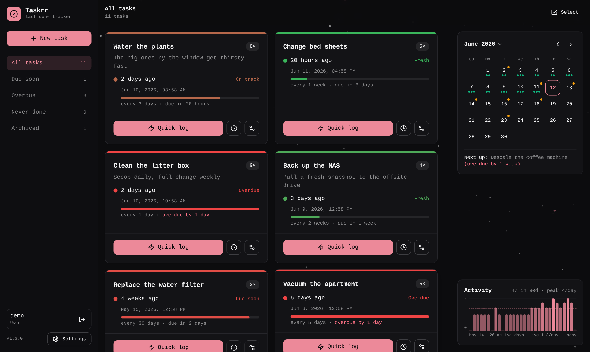
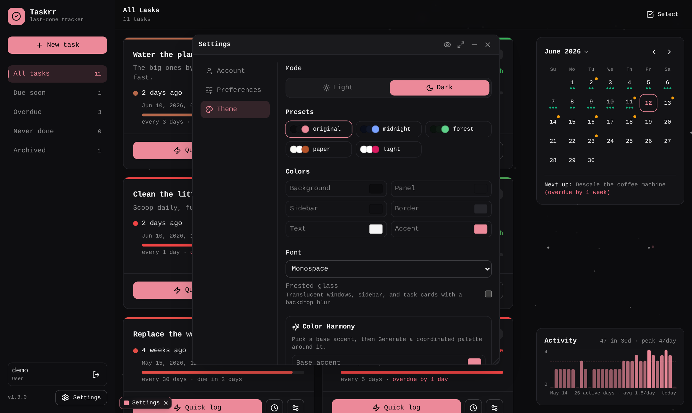

# Taskrr

**A self-hosted tracker for when you last did things.**

Some things aren't really to-dos. Watering the plants, cleaning the
dehumidifier filter, backing up the NAS, descaling the kettle — what matters
isn't a deadline, it's *how long it's been*. Taskrr is built around exactly
that: create a task once, tap **Quick log** each time you do it, and the card
counts up from there. Give a task a routine ("every 2 weeks") and it shades
from green to red as the next one comes due.

One ~12 MB binary, web UI and SQLite baked in. It idles at ~12 MB of memory and
under half a percent of a core, so it's happy on a Pi or whatever small box is
already running in the cupboard.



The whole interface is themeable — colours, light/dark, fonts, animated
backgrounds, frosted glass — from a floating settings window:



## Live demo

**[Try Taskrr in your browser →](https://unmaykr-a.github.io/taskrr/)**

The real UI with no backend behind it: an in-browser mock of the API, seeded
with sample tasks and history, saved to local storage. Every visitor gets their
own sandbox, and there's a "Reset demo" button when you've made a mess of it.
The sample list changes with the season, and you can switch seasons from the
banner. The admin area, SSO, backups and reminder delivery need a real server,
so they aren't in it.

## Running it

```yaml
services:
  taskrr:
    image: ghcr.io/unmaykr-a/taskrr:latest
    restart: unless-stopped
    user: "1000:1000"
    ports: ["8787:8787"]
    environment:
      TASKRR_DB_PATH: /data/taskrr.db
    volumes:
      - ./data:/data
```

That's the whole thing. There's a fuller
[`docker-compose.yml`](./docker-compose.yml) in the repo with a healthcheck and
an optional `.env`, if you'd rather start from that.

Sign in as `admin`; you'll set the password on first run, or preset it with
`TASKRR_ADMIN_PASSWORD` (or `_HASH` — `.env.example` has a one-liner to
generate one). Everything lives in the mounted directory as a single SQLite
file, so backing it up or moving it somewhere else is `cp -r`.

Two things worth knowing before you file a bug:

- **It writes as uid 1000.** The image drops privileges, so the mounted
  directory has to be writable by whoever you run it as, and `user:` has to
  match. This is the one that bites people.
- **Set `TASKRR_COOKIE_SECURE=true` behind TLS.** Session cookies aren't marked
  Secure by default, because the default assumption is `http://` on a LAN. If
  you're proxying it with a certificate, flip this.

Images are `linux/amd64` and `linux/arm64`, and every released version stays
pullable, so you can pin a tag instead of riding `:latest`. There are no
prebuilt binaries — if you want one without Docker, `make build` produces a
single static `bin/taskrr` with everything inside it.

## What it does

- One-tap logging, or pick a time and add a note. History is editable, and a
  stray log has an **Undo** on the toast rather than a trip through the history
  window. Backdate straight from the calendar by clicking the day.
- Right-click anything (long-press on a phone) for the whole menu — log, snooze,
  skip, pin, duplicate, archive, delete. Works on the calendar's day list too.
- Snooze until later, or skip a cycle — which moves the next due date on without
  pretending you did it. Both work on a whole selection at once.
- Routines with due dates: cards shade continuously from fresh to overdue, with
  a progress bar and "due in 3d". Colours are yours, per task and globally.
- A month calendar of what you did and what's coming, plus an activity chart
  over 7 days, 30 days, 90 days or a year.
- Per-task statistics: how often you *actually* do a thing, your longest gap,
  and how that compares to the routine you claimed you'd keep.
- Filters with live counts — all, due soon, overdue, never done, snoozed,
  archived — plus folders in the sidebar to narrow any of them. Bulk actions over
  a selection (log, snooze, skip, routine, tag, folder, archive, delete), and
  pinning for the ones that should stay at the top whatever the sort.
- Tags with search, filtering and an optional colour each, folders, sorting by
  name or last-done, and templates for the setups you reuse.
- Multiple users with per-user data, local passwords, and optional OIDC SSO
  (tested against Authentik and Pocket ID) including group-to-admin mapping.
  `TASKRR_LITE=true` hides the whole multi-user surface if you're the only one.
- Share a single task, or a whole folder — anything you add to a shared folder
  later is included automatically. Optional "whose turn is it" rota, per-user
  opt-out, and an admin switch for the feature as a whole.
- An admin area in the UI: users, registration with an approval queue, active
  sessions, live logs, backups with one-click restore, instance settings, and
  branding down to which of three layouts the sign-in page uses.
- Webhook reminders when something's due — ntfy, Gotify, Apprise, Home
  Assistant, a Discord webhook, anything that takes JSON. Lead time is global
  with a per-task override.
- API tokens for the other direction: log a task from a script, an NFC tag, or
  an automation. A token reaches tasks and history and nothing else — not the
  admin area, not your password.
- Export everything as JSON or CSV. Import a JSON export back, or bring a CSV
  from another tracker and match up the columns.
- Themeable: colour customiser with palette generation, light and dark, animated
  backgrounds, frosted glass, per-animation toggles, and panels that either
  float as windows or behave as plain full-screen menus. Every contrast pair
  clears WCAG AA in all five presets, including whatever accent you pick.
- Keyboard shortcuts (`?` for the list) with rebindable keys, quick-add syntax
  (`water plants every 2 weeks #home`), installable to a phone home screen, and
  a preference to switch off anything above that isn't for you.

## Configuration

All environment variables; [`.env.example`](./.env.example) documents each one
with working examples. The ones that matter:

| Variable | Default | What it does |
| --- | --- | --- |
| `TASKRR_ADDR` | `:8787` | Listen address |
| `TASKRR_DB_PATH` | `./data/taskrr.db` | SQLite file (directory is created) |
| `TASKRR_ADMIN_USERNAME` | `admin` | Bootstrap admin, created on first start |
| `TASKRR_ADMIN_PASSWORD` | — | Its password; unset means you choose one on first sign-in |
| `TASKRR_ADMIN_PASSWORD_HASH` | — | Pre-hashed alternative; wins over the plaintext |
| `TASKRR_SESSION_TTL` | `720h` | Session length; sessions slide while in use |
| `TASKRR_COOKIE_SECURE` | `false` | Set `true` behind HTTPS |
| `TASKRR_TRUST_PROXY_HEADERS` | `true` | Take the client IP from proxy headers; `false` if Taskrr is exposed directly |
| `TASKRR_SECRET_KEY` | — | Encrypts the OIDC client secret at rest, so it isn't sitting in plaintext in your backups |
| `TASKRR_LITE` | `false` | Single-person mode: no registration, no extra accounts |
| `TASKRR_REMINDER_INTERVAL` | `1m` | How often the reminder loop looks for due tasks |
| `TASKRR_SAFETY_BACKUP` | `true` | Snapshot before a restore, so a mistaken restore is undoable |
| `TASKRR_UPDATE_CHECK_URL` | project package.json | Where the admin update check looks; empty disables it |
| `TASKRR_OIDC_*` | — | Issuer, client id/secret, redirect URL — also editable later in the admin UI |

## Building from source

Go 1.25+ and Node 22+:

```bash
git clone https://github.com/unmaykr-a/taskrr.git
cd taskrr
make build           # frontend + backend -> bin/taskrr
./bin/taskrr         # :8787, data in ./data
```

`make dev-backend` and `make dev-frontend` in two terminals for development,
`make test` for both suites, `make install-hooks` for the pre-commit gate,
`make docker` to build the image.

```
cmd/taskrr/          entrypoint
internal/config/     env configuration
internal/store/      SQLite data layer + migrations
internal/api/        HTTP routing + handlers
internal/auth/       password hashing + session tokens
internal/reminder/   the webhook reminder loop
internal/web/        go:embed of the built frontend
web/                 the React/TypeScript frontend
```

## License

[MIT](./LICENSE)
